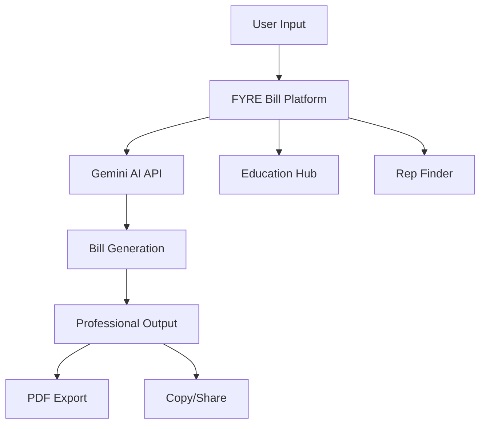

# 🔥 FYRE Bill Platform

**AI-Powered Civic Engagement Platform** | *Transforming Citizens into Lawmakers*

[](https://fyremamba.github.io/Fyre-Bill/)
[](https://opensource.org/licenses/MIT)
[](https://github.com/FYREMamba/Fyre-Bill/stargazers)

---

## 🌟 Overview

FYRE Bill is the first comprehensive AI-powered platform that empowers ordinary citizens to participate meaningfully in the legislative process. By combining advanced AI technology with civic education, we're removing the barriers that have historically excluded citizens from lawmaking.

### 🎯 Mission Statement
*"Democratizing the legislative process through AI, one bill at a time."*

---

## ⚡ Key Features

### 🤖 AI Bill Writer
- **Professional Grade**: Generates legislation that meets state drafting standards
- **State-Specific**: Tailored formatting and legal requirements for all 50 states  
- **Comprehensive**: Includes all necessary legal components (enacting clauses, definitions, enforcement, etc.)
- **Fast**: Professional bill drafts in under 30 seconds

### 📚 Education Hub
- **Constitutional Rights**: Learn your rights as a citizen in the legislative process
- **Bill Lifecycle**: Step-by-step guide from idea to law
- **Civic Empowerment**: Tools and knowledge to engage effectively with government

### 🏛️ Representative Finder
- **Federal & State**: Find your Representatives and Senators
- **Contact Tools**: Direct links to official government contact pages
- **Bill Tracking**: Learn how to monitor your bill's progress through the system

### 🛠️ Advanced Tools
- **Bill Summarization**: AI-powered plain-language summaries
- **Letter Drafting**: Professional letters to representatives
- **PDF Export**: Professional formatting for official submission
- **Copy & Share**: Easy sharing and collaboration features

---

## 🚀 Live Demo

**Try it now:** [https://fyremamba.github.io/Fyre-Bill/](https://fyremamba.github.io/Fyre-Bill/)

### Sample Demo Inputs:
```
State: California
Topic: Solar Energy Tax Credits for Small Businesses
Details: Small businesses need tax incentives to install solar panels, reducing energy costs and supporting green energy adoption while meeting climate goals.
```

---

## 🏗️ Technology Stack

| Component | Technology | Purpose |
|-----------|------------|---------|
| **Frontend** | HTML5, CSS3, JavaScript | Responsive web interface |
| **Styling** | Tailwind CSS | Modern, mobile-first design |
| **AI Engine** | Google Gemini API | Advanced text generation |
| **PDF Generation** | html2pdf.js | Document export functionality |
| **Deployment** | GitHub Pages | Static site hosting |

---

## 📊 Technical Architecture



---

## 🛠️ Installation & Setup

### Prerequisites
- Modern web browser with JavaScript enabled
- Google Gemini API key ([Get one here](https://ai.google.dev/))

### Quick Start
1. **Clone the repository**
   ```bash
   git clone https://github.com/FYREMamba/Fyre-Bill.git
   cd Fyre-Bill
   ```

2. **Add your API key**
   ```javascript
   // In index.html, replace YOUR_API_KEY_HERE
   const API_KEY = 'your-actual-gemini-api-key';
   ```

3. **Launch locally**
   ```bash
   # Simple HTTP server
   python -m http.server 8000
   # Or use any static file server
   ```

4. **Open in browser**
   ```
   http://localhost:8000
   ```

---

## 🎯 Use Cases

### 👥 For Citizens
- Draft professional bills on issues you care about
- Learn your constitutional rights in the legislative process
- Find and contact your representatives effectively
- Track bills through the legislative system

### 🏢 For Organizations
- Streamline advocacy campaigns with professional bill drafts
- Educate members on civic engagement
- Coordinate grassroots legislative efforts
- Professional presentation to lawmakers

### 🎓 For Educators
- Teach civic engagement and government processes
- Hands-on learning about how laws are made
- Constitutional rights education
- Mock legislative exercises

---

## 📈 Impact & Metrics

### Current Achievements
- ✅ **Professional Quality**: AI-generated bills meet legislative standards
- ✅ **Accessibility**: Complex legal processes made simple
- ✅ **Speed**: 30-second bill generation vs. weeks of traditional drafting
- ✅ **Education**: Comprehensive civic engagement curriculum

### Target Metrics
| Metric | Year 1 Goal | Year 3 Goal |
|--------|-------------|-------------|
| Active Users | 10,000 | 100,000 |
| Bills Generated | 5,000 | 50,000 |
| Legislative Introductions | 100+ | 1,000+ |
| Civic Education Completions | 25,000 | 250,000 |

---

## 🗺️ Roadmap

### Phase 1: Foundation ✅
- [x] Core AI bill generation
- [x] Educational content
- [x] Representative finder
- [x] PDF export functionality

### Phase 2: Enhancement (Q2 2025)
- [ ] User accounts and bill saving
- [ ] Collaboration tools for co-authoring
- [ ] Advanced bill templates by category
- [ ] Integration with official legislative databases

### Phase 3: Scale (Q3 2025)
- [ ] Mobile applications (iOS/Android)
- [ ] API for third-party integrations
- [ ] Advanced analytics and tracking
- [ ] Multi-language support

### Phase 4: Network (Q4 2025)
- [ ] Coalition building tools
- [ ] Legislative campaign management
- [ ] Success story showcases
- [ ] Partnership with civic organizations

---

## 🤝 Contributing

We welcome contributions from developers, civic technologists, legal experts, and passionate citizens!

### How to Contribute
1. **Fork the repository**
2. **Create a feature branch** (`git checkout -b feature/amazing-feature`)
3. **Make your changes** and test thoroughly
4. **Commit your changes** (`git commit -m 'Add amazing feature'`)
5. **Push to the branch** (`git push origin feature/amazing-feature`)
6. **Open a Pull Request**

### Areas We Need Help
- **Legal Expertise**: State-specific legislative formatting
- **UX/UI Design**: Improving user experience
- **API Integrations**: Government data sources
- **Mobile Development**: Native app versions
- **Documentation**: Tutorials and guides

---

## 📋 API Reference

### Core Functions

#### `generateBill(state, topic, details)`
Generates a professional legislative bill using AI.

**Parameters:**
- `state` (string): Target state for legislation
- `topic` (string): Main subject of the bill  
- `details` (string): Specific requirements and goals

**Returns:** Promise<string> - Formatted legislative bill

#### `summarizeBill(billText)`
Creates a plain-language summary of a bill.

**Parameters:**
- `billText` (string): Full text of the generated bill

**Returns:** Promise<string> - Accessible summary

#### `draftLetter(billText, state, topic)`
Generates a professional letter to representatives.

**Parameters:**
- `billText` (string): Generated bill content
- `state` (string): Representative's state
- `topic` (string): Bill topic for context

**Returns:** Promise<string> - Professional advocacy letter

---

## 🔒 Security & Privacy

### Data Protection
- **No Personal Data Storage**: All processing happens client-side
- **API Security**: Requests use HTTPS encryption
- **No Tracking**: We don't collect or store user information
- **Open Source**: Full transparency in our codebase

### Best Practices
- API keys should be secured server-side in production
- Consider rate limiting for high-traffic deployments
- Regular security audits recommended

---

## 📄 License

This project is licensed under the MIT License - see the [LICENSE](LICENSE) file for details.

### What this means:
- ✅ Commercial use allowed
- ✅ Modification allowed  
- ✅ Distribution allowed
- ✅ Private use allowed
- ❗ License and copyright notice required

---

## 🙋‍♂️ Support & Community

### Get Help
- 📧 **Email**: [Insert contact email]
- 💬 **Discussions**: [GitHub Discussions](https://github.com/FYREMamba/Fyre-Bill/discussions)
- 🐛 **Issues**: [Bug Reports](https://github.com/FYREMamba/Fyre-Bill/issues)
- 📖 **Documentation**: [Wiki](https://github.com/FYREMamba/Fyre-Bill/wiki)

### Connect With Us
- 🐦 **Twitter**: [@FYREArmy](https://twitter.com/FYREArmy)
- 💼 **LinkedIn**: [FYRE Army](https://linkedin.com/company/fyre-army)
- 🌐 **Website**: [Coming Soon]

---

## 🏆 Acknowledgments

### Built By
- **FYRE Army** - Concept and Vision
- **CryptoHighway84** - Lead Developer
- **Contributors** - Community enhancements

### Powered By
- **Google Gemini AI** - Advanced language model
- **Tailwind CSS** - Beautiful, responsive design
- **GitHub Pages** - Reliable hosting platform

### Inspired By
The belief that every citizen should have equal access to the legislative process, regardless of their legal expertise or financial resources.

---

## 📊 Project Statistics


---

<div align="center">

### 🔥 **"Turning Citizens into Lawmakers, One Bill at a Time"** 🔥

**[Try FYRE Bill Now →](https://fyremamba.github.io/Fyre-Bill/)**

</div>

---
Contact Matron at mambavidz@gmail.com

*Made with ❤️ by FYRE Army | Empowering Democracy Through Technology*
